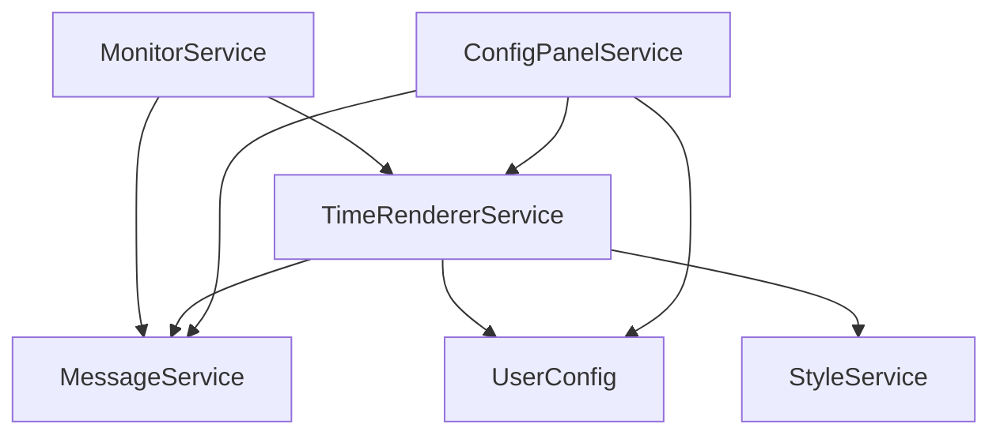
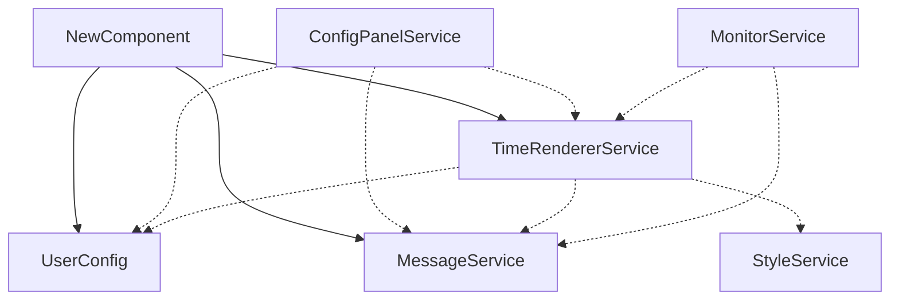

# <div align="center">ChatGPT 消息时间</div>

<div align="center">
  
  
  
  
</div>

## 1. 介绍

有时我们希望看到 ChatGPT 的消息时间，但 ChatGPT 并没有显示消息时间的功能。
本项目通过 Tampermonkey 开发，可以在 Chrome 和 Firefox 等支持 Tampermonkey 插件的浏览器上使用，实现显示 ChatGPT
每一条消息时间的功能。

该插件不但可以获取以往的消息时间，还可以实时获取新消息的时间。


提供多种配置选项，例如时间显示格式、时间显示位置等。


除此之外，时间样式高度自定义，你可以输入以下 html 代码来实现上图的效果。具体的时间格式化规则请参考 [#](#)

```html
<span style="border-radius: 8px; color: #E0E0E0; font-size: 0.9em; overflow: hidden; display: inline-block;"><span
        style="background: #333; padding: 2px 4px 2px 10px; display: inline-block;">{yyyy}-{MM}-{dd}</span><span
        style="background: #606060; padding: 2px 10px 2px 4px; display: inline-block;">{HH}:{mm}:{ss}</span></span>
```

## 2. 使用方法

### 2.1 安装 Tampermonkey

可查看 [Tampermonkey 首页](https://www.tampermonkey.net/index.php?browser=chrome&locale=zh) 查看详细的使用方法。

### 2.2 安装脚本

访问链接: [Greasy Fork - ChatGPT with Date](https://greasyfork.org/en/scripts/xxxxxxx-chatgpt-with-date)
，点击 `安装此脚本` 安装脚本。

### 2.3 使用

打开 ChatGPT 页面，即可看到消息时间。你可以在此处打开配置面板。


## 3. 配置

### 3.1 时间格式

默认支持的时间格式有：

| 模板                                     | 样例                      |
|----------------------------------------|-------------------------|
| `{yyyy}-{MM}-{dd} {HH}:{mm}:{ss}`      | 2000-12-31 00:00:00     |
| `{MM}/{dd}/{yyyy} {HH}:{mm}:{ss}`      | 12/31/2000 00:00:00     |
| `{MM}-{dd} {HH}:{mm}:{ss}`             | 12-31 00:00:00          |
| `{MM}-{dd} {HH}:{mm}`                  | 12-31 00:00             |
| `{yyyy}-{MM}-{dd} {HH}:{mm}:{ss}.{ms}` | 2000-12-31 00:00:00.000 |

支持的时间元素有：

- `{yyyy}`: 年份
- `{MM}`: 月份
- `{dd}`: 日期
- `{HH}`: 小时
- `{mm}`: 分钟
- `{ss}`: 秒
- `{ms}`: 毫秒

你完全可以自定义时间格式，只需要输入你想要的 html 代码即可，脚本将替换上面的模板时间元素为当前时间的相应数据。
在介绍中已经给出了一个示例：

```html
<span style="border-radius: 8px; color: #E0E0E0; font-size: 0.9em; overflow: hidden; display: inline-block;"><span
        style="background: #333; padding: 2px 4px 2px 10px; display: inline-block;">{yyyy}-{MM}-{dd}</span><span
        style="background: #606060; padding: 2px 10px 2px 4px; display: inline-block;">{HH}:{mm}:{ss}</span></span>
```

### 3.2 时间位置

时间位置有三种选择：

- `角色之后（靠左）`: 时间显示在角色名字的后面，并靠左显示。
- `角色之后（靠右）`: 时间显示在角色名字的后面，并靠右显示。
- `角色之下`: 时间显示在角色名字下方。

## 4. 反馈

如果你有任何问题或建议，欢迎在 [GitHub Issues](https://github.com/jiang-taibai/chatgpt-with-date/issues)
或 [脚本反馈区](https://greasyfork.org/zh-CN/scripts/xxxxxxx-chatgpt-with-date/feedback) 中提出。

## 5. 未来计划

- [ ] 国际化：脚本支持多种语言（日志、提示等）。
- [ ] 时间格式化细粒度配置面板：优化时间格式自定义功能，而不是难以维护的 HTML字符串 表示。
- [ ] 时间格式化元素：支持更多的时间格式化元素，例如星期、月份（英文）等。
- [ ] 时间格式化规则：支持更多的时间格式化规则，例如 12 小时制、24 小时制等。

## 6. 开源协议

本项目遵循 [MIT](https://opensource.org/licenses/MIT) 开源协议。

CopyRight © 2024~Present [Jiang Liu](https://coderjiang.com)

## 7. 供给开发者自定义修改脚本的文档

### 7.1 项目组织架构

本项目采用依赖注入（DI）的方式组织各个 Component，主要包括以下几个部分：

- `UserConfig`: 用户配置信息，包括时间格式、时间位置等。
- `StyleService`: 样式服务，负责跟踪管理一些可变化的样式。
- `MessageService`: 消息服务，负责管理和存储消息信息。
- `MonitorService`: 监控服务，负责劫持 Fetch 请求和实时监听页面新消息的添加。
- `TimeRendererService`: 时间渲染服务，负责渲染时间。
- `ConfigPanelService`: 配置面板服务，负责生成基于 Vue+NaiveUI 的配置面板。

上述服务之间的依赖关系如下：



本项目采用的依赖注入方式限制了循环依赖的发生，依赖注入的设计架构允许组件保持独立于其依赖项的具体实现。这种技术可以使代码更容易理解、维护和测试。
之所以要避免循环依赖，因为循环依赖违反了单一职责原则、依赖倒置原则。

### 7.2 定义新的 Component

如果你想自定义一个新的 Component，你需要：

#### (1) 定义一个新的 Component 类

- 继承：该类必须继承自 `Component` 类
- 构造函数：在构造函数中定义 `dependencies` 属性，该属性是一个数组，数组中的每个元素是一个对象，对象包含两个属性：`field`
  和 `clazz`，分别表示依赖的字段名和依赖的类。
- 依赖注入：不应该在构造函数中进行除了定义依赖关系之外的其他操作，因为依赖关系的注入是在 `Component::initDependencies`
  方法中进行的。在该方法执行之前，依赖关系是无法使用的。
- 初始化函数：在 `init` 方法中进行正式的初始化操作，在该方法中可以使用依赖注入的属性。
- 依赖关系：应当避免循环依赖，否则会导致初始化失败。

```javascript
class NewComponent extends Component {
    constructor() {
        super();
        this.userConfig = null
        this.timeRendererService = null
        this.messageService = null
        this.dependencies = [
            {field: 'userConfig', clazz: UserConfig},
            {field: 'timeRendererService', clazz: TimeRendererService},
            {field: 'messageService', clazz: MessageService},
        ]
    }

    init() {
        // 正式初始化
    }
}
```

#### (2) 注册该 Component

将你的 Component 注册到 `Main.ComponentsConfig` 中，不必担心注册的顺序，因为 Main 类会自动按照依赖关系的顺序进行初始化。

```javascript
class Main {
    static ComponentsConfig = [
        UserConfig, StyleService, MessageService,
        MonitorService, TimeRendererService, ConfigPanelService,
        NewComponent,
    ]
}
```

于是新的依赖关系图如下所示：



### 7.3 一些建议

#### (1) 注入外部 JavaScript 库

请使用 GM_xmlhttpRequest 来获取外部 JavaScript 库的内容，再以字符串的形式注入到页面中。
如果你直接在页面中引入外部 JavaScript 库，可能有CSP限制。
下面是在项目中注入 Vue.js 和 NaiveUI 的示例：

```javascript
function loadScript() {
    return new Promise(resolve => {
        // ✅✅ 以下方法没有 CSP 限制
        let completeCount = 0;
        const addScript = (content) => {
            let script = document.createElement('script');
            script.textContent = content;
            document.body.appendChild(script);
            completeCount++;
            if (completeCount === 2) {
                resolve()
            }
        }
        GM_xmlhttpRequest({
            method: "GET", url: "https://unpkg.com/vue@3.4.26/dist/vue.global.js", onload: function (response) {
                addScript(response.responseText);
            }
        });
        GM_xmlhttpRequest({
            method: "GET", url: "https://unpkg.com/naive-ui@2.38.1/dist/index.js", onload: function (response) {
                addScript(response.responseText);
            }
        });
        // ❎❎ 以下方法有 CSP 限制
        // const naiveScript = document.createElement('script');
        // naiveScript.setAttribute("type", "text/javascript");
        // naiveScript.text = "https://unpkg.com/naive-ui@2.38.1/dist/index.js";
        // document.documentElement.appendChild(naiveScript);
    })
}
```

