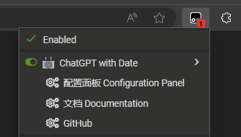

# 
ChatGPT with Date

  
  
  
  

    <a href="#">English</a> | <a href="README_zh.md">中文</a>

## 1. Introduction

Sometimes we want to see the timestamp of messages from ChatGPT, but ChatGPT does not have the feature to display
message timestamps.
This project is developed using Tampermonkey and can be used on browsers that support the Tampermonkey plugin, such as
Edge, Chrome, Firefox, Safari, and Opera, to enable the display of timestamps for each message from ChatGPT.

This plugin can not only retrieve **historical message timestamps** but also obtain the time of new messages in
real-time.

Accessing the [Configuration Interface](https://jiang-taibai.github.io/chatgpt-with-date-config-page/) provides a
variety of configuration options.

If you are familiar with the web trifecta (HTML, CSS, JavaScript), you can highly customize the time style.

We will introduce the configurations as shown above and more rules in section three.

## 2. How to Use

### 2.1 Install Tampermonkey

Visit the [Tampermonkey homepage](https://www.tampermonkey.net/index.php?browser=chrome&locale=zh) to see detailed
instructions.

### 2.2 Install the Script

Go to: [Greasy Fork - ChatGPT with Date](https://greasyfork.org/en/scripts/493949-chatgpt-with-date)
and click on `Install this script` to install the script.

### 2.3 Usage

Open the ChatGPT page, and you will see the message timestamps. You can open the configuration panel here.

## 3. Detailed Documentation

Please visit the [ChatGPT with Date Documentation](https://jiang-taibai.github.io/chatgpt-with-date/) for detailed
configuration instructions and developer documentation.

## 4. Feedback

If you have any questions or suggestions, feel free to raise them
on [GitHub Issues](https://github.com/jiang-taibai/chatgpt-with-date/issues)
or the [Script Feedback Section](https://greasyfork.org/en/scripts/493949-chatgpt-with-date/feedback).

## 5. Future Plans

- [x] Internationalization: The script supports multiple languages (logs, prompts, etc.).
- [x] Time Formatting Granular Configuration Panel: Optimizing time format customization features, instead of
  hard-to-maintain HTML string representations.
- [x] Time Formatting Elements: Support for more time formatting elements, such as weekdays, months (in English), etc.
- [x] Time Formatting Rules: Support for more time formatting rules, such as 12-hour and 24-hour formats.
- [x] Support for Shared Interface: Support for displaying time on the interface of `https://chatgpt.com/share/uuid` (
  i.e., the shared chat interface).
- [ ] Theme Website: Provide a theme website to showcase user-shared time label themes.
- [x] Reset Script: Due to crashes caused by applying user input locally, a reset script functionality is provided.
- [x] Provide More Lifecycle Hooks and Custom Functions: For example, how time elements can be customized for parsing.

## 6. Open Source License

This project is licensed under the [MIT License](https://opensource.org/licenses/MIT).

CopyRight © 2024~Present [Jiang Liu](https://coderjiang.com)

## X. Changelog

- **v2.0.3 - 2024-08-21 00:45:25**
    - **Optimization**: modify link matching mechanism

- **v2.0.2 - 2024-07-29 02:11:47**
    - **Optimization**: Unified access to resources hosted on GitHub.
    - **New Feature**: Support for displaying time on shared interfaces.
    - **Fix**: Improve the grammatical hints of prompt words, and provide both Chinese and English versions.
    - **New**: Provide English documentation
    - **Optimization**: provide more menu items for users to view documents, feedback, etc.

- **v2.0.1 - 2024-06-15 16:33:35**
    - **Fix**: Resolved the issue where switching between messages forces the time to update to the current time.

- **v2.0.0 - 2024-06-13 16:58:05**
    - **Fix**: Adapted to the new ChatGPT conversational UI.
    - **New Feature**: Introduced a new configuration page (due to ChatGPT's lack of support for `unsafe-eval`).
    - **Feature Adjustment**: To accommodate the new UI, support for "time badge insertion position" was removed.

- **v1.3.0 - 2024-05-06 19:48:01**
    - **New Features**:
        - Internationalization (i18n) support.
        - Functionality to reset the script.
        - Custom prompts to generate HTML, CSS, and JavaScript code suitable for this plugin.
        - Tutorial access.
        - Ability to collapse and expand the configuration panel.
    - **Optimization**: Support for customizing the height of the code input box.

- **v1.2.3 - 2024-05-04 20:04:51**
    - **Fix**: Resolved an issue preventing custom user code from running properly.
    - **Optimization**:
        - Ensured that errors in custom code do not affect the entire script.
        - Adjusted the rendering order to prioritize the most recent messages.

- **v1.2.2 - 2024-05-04 15:24:44**
    - **Fix**: Resolved issues with message ID attribute changes leading to failures in locating target message DOM
      nodes.

- **v1.2.1 - 2024-05-04 14:33:12**
    - **Fix**: Updated domain names for ChatGPT.

- **v1.2.0 - 2024-05-03 21:26:43**
    - **Optimizations**:
        - Limited the number and total duration of time label renderings to prevent page lag.
        - Set time label rendering functions to execute asynchronously to avoid blocking page rendering.
        - Enhanced Fetch hijacking URL matching rules for accuracy and minimized interference with other requests.
          Hijacking operations are now performed only when URL matches are confirmed.
        - Replaced cold template HTML strings with direct examples of time formats when selecting templates.
    - **New Features**:
        - Added more elements for time formats, such as weekdays and months in English.
        - Added more rules for time formatting, such as 12-hour and 24-hour formats.
        - Introduced a code editor and injection system for custom HTML, CSS, and JavaScript styles.
        - Provided lifecycle hook functions `window.beforeCreateTimeTag(messageId, timeTagHTML)`
          and `window.afterCreateTimeTag(messageId, timeTagNode)`.

- **v1.1.0 - 2024-05-02 17:50:04**
    - **New Feature**: Added more templates for time formats.

