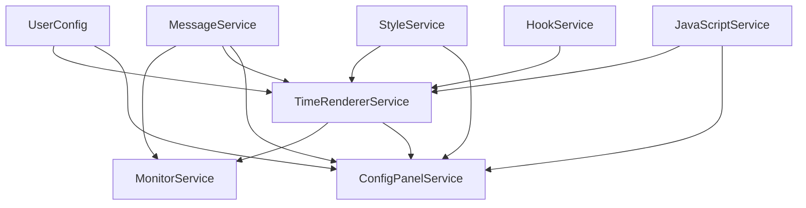
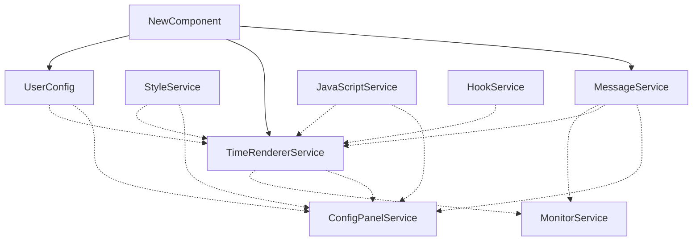

# <div>ChatGPT 消息时间</div>

<div>
  
  
  
  
</div>

## 1. 介绍

有时我们希望看到 ChatGPT 的消息时间，但 ChatGPT 并没有显示消息时间的功能。
本项目通过 Tampermonkey 开发，可以在 Edge、Chrome、Firefox、Safari、Opera 等支持 Tampermonkey 插件的浏览器上使用，
实现显示 ChatGPT 每一条消息时间的功能。

该插件不但可以获取**历史消息时间**，还可以实时获取新消息的时间。


访问 [配置界面](https://jiang-taibai.github.io/chatgpt-with-date-config-page/) 提供多种配置选项。


如果你了解网页三剑客（HTML、CSS、JavaScript），你完全可以高度自定义时间样式。


我们将在第三节介绍如上图所示的配置以及更多的规则。

## 2. 使用方法

### 2.1 安装 Tampermonkey

可查看 [Tampermonkey 首页](https://www.tampermonkey.net/index.php?browser=chrome&locale=zh) 查看详细的使用方法。

### 2.2 安装脚本

访问链接: [Greasy Fork - ChatGPT with Date](https://greasyfork.org/en/scripts/493949-chatgpt-with-date)
，点击 `安装此脚本` 安装脚本。

### 2.3 使用

首次使用请允许跨源资源共享（CORS）请求，本项目将请求 Vue.js 和 NaiveUI 的资源，以便生成配置面板。


打开 ChatGPT 页面，即可看到消息时间。你可以在此处打开配置面板。


## 3. 配置

### 3.1 时间模板

系统默认的模板实际上是一个 HTML 字符串，下面是几个默认模板的示例：

(1) 常规

<span style="padding-right: 1rem; color: #ababab; font-size: 0.9em;">2024-04-01 18:06:09</span>

```html
<span style="padding-right: 1rem; color: #ababab; font-size: 0.9em;">{yyyy}-{MM}-{dd} {HH}:{mm}:{ss}</span>
```

(2) 12 小时制

<span style="padding-right: 1rem; color: #ababab; font-size: 0.9em;">May 06, 2024 03:55 PM</span>

```html
<span style="padding-right: 1rem; color: #ababab; font-size: 0.9em;">{MM#shortname@en} {dd}, {yyyy} {HH#12}:{mm} {HH#tag}</span>
```

(3) 徽标类

<span style="padding-right: 1rem; margin-bottom: .5rem; color: #E0E0E0; font-size: 0.9em;"><span style="background: #333; padding: 1px 4px 1px 10px; display: inline-block; border-radius: 8px 0 0 8px;">
2024-05-06</span><span style="background: #606060; padding: 1px 10px 1px 4px; display: inline-block; border-radius: 0 8px 8px 0;">
15:56:22</span></span>

```html
<span style="padding-right: 1rem; margin-bottom: .5rem; color: #E0E0E0; font-size: 0.9em;"><span
        style="background: #333; padding: 1px 4px 1px 10px; display: inline-block; border-radius: 8px 0 0 8px;">{yyyy}-{MM}-{dd}</span><span
        style="background: #606060; padding: 1px 10px 1px 4px; display: inline-block; border-radius: 0 8px 8px 0;">{HH}:{mm}:{ss}</span></span>
```

### 3.3 高级配置

#### 3.3.1 时间格式

支持的时间元素有（以 2024年4月3日18点9分1秒999毫秒周五 为例）

| 元素                                         | 介绍      | 示例     |
|--------------------------------------------|---------|--------|
| `{yyyy}`                                   | 四位的年份   | 2024   |
| `{yy}`                                     | 两位的年份   | 24     |
| `{MM}`, `{MM:02}`                          | 至少两位的月份 | 04     |
| `{MM:01}`                                  | 至少一位的月份 | 4      |
| `{MM#name@zh}`                             | 中文月份    | 四      |
| `{MM#name@en}`, `{MM#fullname@en}`         | 英文月份    | April  |
| `{MM#shortname@en}`                        | 英文缩写月份  | Apr    |
| `{dd}`, `{dd:02}`                          | 当前月已过天数 | 03     |
| `{dd:01}`                                  | 当前月已过天数 | 3      |
| `{HH}`, `{HH:02}`, `{HH#24}`, `{HH#24:02}` | 小数      | 18     |
| `{HH:01}`, `{HH#24:01}`                    | 小时      | 18     |
| `{HH#12}`, `{HH#12:02}`                    | 12小时制小时 | 06     |
| `{HH#12:01}`                               | 12小时制小时 | 6      |
| `{HH#tag}`, `{HH#tag@en}`                  | 上下午     | PM     |
| `{HH#tag@zh}`                              | 上下午     | 下午     |
| `{mm}`, `{mm:02}`                          | 分钟      | 09     |
| `{mm:01}`                                  | 分钟      | 9      |
| `{ss}`, `{ss:02}`                          | 秒数      | 01     |
| `{ss:01}`                                  | 秒数      | 1      |
| `{ms}`                                     | 毫秒      | 999    |
| `{week}`, `{week:02}`                      | 星期      | 05     |
| `{week:01}`                                | 星期      | 5      |
| `{week#name@zh}`                           | 中文星期    | 五      |
| `{week#name@en}`, `{week#fullname@en}`     | 英文星期    | Friday |
| `{week#shortname@en}`                      | 英文缩写星期  | Fri    |

高级配置提供了更多的自定义选项，你可以自定义时间标签的 HTML、CSS、JavaScript 代码。

#### 3.3.2 钩子函数

本项目提供了三个钩子函数，你可以在这些函数中实现你想要的功能。

- `window.ChatGPTWithDate.hooks.formatDateTimeByDate(date, template)`: 根据 Date 对象将模板 HTML 字符串中的占位符替换为时间元素
    - 默认实现：将占位符替换为时间元素
    - `date`: 日期 Date 对象
    - `template`: 时间格式字符串模板
    - 返回值: 格式化后的时间字符串
- `window.ChatGPTWithDate.hooks.beforeCreateTimeTag(messageId, timeTagHTML)`: 在创建时间标签之前调用，你可以在这里修改时间标签的
  HTML 内容。
    - 默认实现：空函数
    - `messageId`: 消息的 ID。
    - `timeTagHTML`: 时间标签的 HTML 内容。
- `window.ChatGPTWithDate.hooks.afterCreateTimeTag(messageId, timeTagNode)`: 在创建时间标签之后调用，你可以在这里修改时间标签的
  DOM 节点。
    - 默认实现：空函数
    - `messageId`: 消息的 ID。
    - `timeTagNode`: 时间标签的 DOM 节点。

#### 3.3.3 示例

在介绍章节中，我们展示了如何使用高级配置功能来显示一个可以将日期显示为几天前的时间标签，下面是具体的代码：

```html

<div class="text-tag-box">
    <span class="date">{yyyy}-{MM}-{dd}</span>
    <span class="time">{HH}:{mm}:{ss}</span>
</div>
```

```css
.text-tag-box {
    border-radius: 8px;
    color: #E0E0E0;
    font-size: 0.9em;
    overflow: hidden;
    display: inline-block;
}

.text-tag-box .date {
    background: #333;
    float: left;
    padding: 2px 8px 2px 10px;
    display: inline-block;
    transition: width 0.5s ease-out;
    white-space: nowrap;
}

.text-tag-box .time {
    background: #606060;
    float: left;
    padding: 2px 10px 2px 8px;
    display: inline-block;
}
```

```javascript
(() => {
    const getNewWidth = (targetNode, text) => {
        // 创建一个临时元素来测量文本宽度
        const temp = targetNode.cloneNode();
        temp.style.width = 'auto'; // 自动宽度
        temp.style.visibility = 'hidden'; // 隐藏元素，不影响布局
        temp.style.position = 'absolute'; // 避免影响其他元素
        temp.style.whiteSpace = 'nowrap'; // 无换行
        temp.innerText = text;
        document.body.appendChild(temp);
        const newWidth = temp.offsetWidth;
        document.body.removeChild(temp);
        return newWidth;
    }

    window.ChatGPTWithDate.hooks.afterCreateTimeTag = (messageId, timeTagNode) => {
        const dateNode = timeTagNode.querySelector('.date');
        const date = dateNode.innerText;
        const originalWidth = getNewWidth(dateNode, date);
        const paddingWidth = 18;
        dateNode.style.width = (originalWidth + paddingWidth) + 'px';

        timeTagNode.addEventListener('mouseover', () => {
            const now = new Date();
            const offset = now - new Date(date);
            const days = Math.floor(offset / (24 * 60 * 60 * 1000));
            let text = '';
            if (days < 1)
                text = '今天';
            else if (days < 2)
                text = '昨天';
            else if (days < 3)
                text = '前天';
            else if (days < 7)
                text = days + '天前';
            else if (days < 30)
                text = Math.floor(days / 7) + '周前';
            else if (days < 365)
                text = Math.floor(days / 30) + '个月前';
            else
                text = Math.floor(days / 365) + '年前';
            dateNode.innerText = text;
            dateNode.style.width = (getNewWidth(dateNode, text) + paddingWidth) + 'px';
        });

        // 鼠标移出 timeTagNode 时恢复 dateNode 的内容为原来的日期
        timeTagNode.addEventListener('mouseout', () => {
            dateNode.innerText = date;
            dateNode.style.width = (originalWidth + paddingWidth) + 'px';
        });
    }
})()
```

#### 3.3.4 提示词 ✨

既然是用在 ChatGPT 上的，那么我们可以利用 ChatGPT 根据提示词来生成你想要的效果对应的 HTML、CSS、JavaScript 代码。

````markdown
# 1. 任务简介

你需要写 HTML、CSS、JavaScript 代码，实现我的需求，后面我将详细介绍你应该怎么写代码。

# 2. HTML 要求

你需要写一个日期时间的模板 HTML 字符串，你可以使用占位符来表示时间元素，例如：

```html
<div class="text-tag-box">
    <span class="date">{yyyy}-{MM}-{dd}</span>
    <span class="time">{HH}:{mm}:{ss}</span>
</div>
```

后面会介绍你怎么用 JavaScript 来实现显示特定的时间。

# 3. CSS 要求

(1) 不允许写标签选择器，只能写类选择器或 ID 选择器
(2) 尽量写后代选择器，不污染全局样式
(3) 尽量不要使用 `!important`

# 4. JavaScript 要求

## 4.1 提供的 API 接口

API 定义在 window 上，如有必要你需要在 JS 脚本内重写函数。

- window.ChatGPTWithDate.hooks.formatDateTimeByDate(date, template): 根据 Date 对象将模板 HTML 字符串中的内容替换为 date
  对象指定的时间
    - date: 日期 Date 对象
    - template: HTML 字符串，即你写的 HTML 代码
    - 返回值: 格式化后的 HTML 代码
- window.ChatGPTWithDate.hooks.beforeCreateTimeTag(messageId, timeTagHTML): 将 template 插入到页面之前调用
    - messageId: 消息的 ID，并非 HTML 元素的 ID
    - timeTagHTML: 此时的字符串是 '<div class="chatgpt-time">' + window.ChatGPTWithDate.hooks.formatDateTimeByDate(date,
      template) + '</div>'
    - 返回值: 无
- window.ChatGPTWithDate.hooks.afterCreateTimeTag(messageId, timeTagNode): 将 template 插入到页面之后调用
    - messageId: 消息的 ID，并非 HTML 元素的 ID
    - timeTagNode: 此时的节点是 '<div class="chatgpt-time">' + window.ChatGPTWithDate.hooks.formatDateTimeByDate(date,
      template) + '</div>' 的 DOM 节点
    - 返回值: 无

## 4.2 API 执行逻辑

系统会按照以下顺序执行 API：

(1) template = 你输入的 HTML 代码
(2) template = window.ChatGPTWithDate.hooks.formatDateTimeByDate(date, template)
(3) timeTagHTML = '<div class="chatgpt-time">' + template + '</div>'
(4) window.ChatGPTWithDate.hooks.beforeCreateTimeTag(messageId, timeTagHTML)
(5) 将 timeTagHTML 插入到某位置
(6) timeTagNode = 刚刚插入的 timeTagHTML 节点
(7) window.ChatGPTWithDate.hooks.afterCreateTimeTag(messageId, timeTagNode)

## 4.3 代码规范

(1) 请使用 ES6 语法
(2) 请使用严格模式 `'use strict'`
(3) 请使用 `const` 和 `let` 声明变量
(4) 请使用 IIFE 避免全局变量污染
(5) 请使用 `===` 和 `!==` 避免类型转换问题
(6) 注释一律写中文注释

# 5. 案例

以下是一个案例，实现光标移动到时间标签上时，日期显示为几天前的效果。

HTML 代码：

```html
<div class="text-tag-box">
    <span class="date">{yyyy}-{MM}-{dd}</span>
    <span class="time">{HH}:{mm}:{ss}</span>
</div>
```

CSS 代码：

```css
.text-tag-box {
    border-radius: 8px;
    color: #E0E0E0;
    font-size: 0.9em;
    overflow: hidden;
    display: inline-block;
}

.text-tag-box .date {
    background: #333;
    float: left;
    padding: 2px 8px 2px 10px;
    display: inline-block;
}

.text-tag-box .time {
    background: #606060;
    float: left;
    padding: 2px 10px 2px 8px;
    display: inline-block;
}
```

JavaScript 代码：

```javascript
(() => {
    window.ChatGPTWithDate.hooks.formatDateTimeByDate = (date, template) => {
        const formatValue = (value, format) => value.toString().padStart(format === 'yyyy' ? 4 : 2, '0');
        const dateValues = {
            '{yyyy}': date.getFullYear(),
            '{MM}': date.getMonth() + 1,
            '{dd}': date.getDate(),
            '{HH}': date.getHours(),
            '{mm}': date.getMinutes(),
            '{ss}': date.getSeconds()
        };
        return template.replace(/\{[^}]+\}/g, match => formatValue(dateValues[match], match.slice(1, -1)));
    }
    window.ChatGPTWithDate.hooks.afterCreateTimeTag = (messageId, timeTagNode) => {
        const dateNode = timeTagNode.querySelector('.date');
        const dateText = dateNode.innerText;
        const date = new Date(dateText);
        timeTagNode.addEventListener('mouseover', () => {
            dateNode.innerText = `${Math.floor((new Date() - date) / 86400000)}天前`;
        });
        timeTagNode.addEventListener('mouseout', () => {
            dateNode.innerText = dateText;
        });
    }
})()
```

# 5. 你的任务

现在你需要写三段代码，分别为HTML、CSS、JavaScript，要求如下：

- HTML：你只需要写时间标签的 HTML
- CSS：请使用类选择器或 ID 选择器，不要使用标签选择器（除非是子选择器）
- JavaScript：请在 IIFE 中编写代码，你可以使用上面讲到的三个钩子函数。
- 不要说废话，直接上代码，分为三个代码块给我，在每个代码块之前写上“这是HTML代码”、“这是CSS代码”、“这是JS代码”。
- 接下来的对话我不会重复以上的内容，你需要记住这些内容。
- 我每次会告诉你我需要怎么改进你的代码，你需要根据我的要求修改代码。

# 6. 你需要完成的我的需求

日期时间格式：2024-04-03 18:09:01
样式：时间标签显示为一个灰色的矩形框，日期显示在左边，时间显示在右边，日期和时间之间有一个竖线分隔
额外效果：当鼠标移动到时间标签上时，时间标签抖动一下。
````

#### 3.3.5 注意事项

1. 请不要在代码中使用外部资源，例如图片、字体等，因为这些资源可能会被网站的 CSP 拦截。
2. JavaScript：请在 IIFE 中编写代码，尽量不要使用全局变量，在重复执行时可能会出错。

## 4. 反馈

如果你有任何问题或建议，欢迎在 [GitHub Issues](https://github.com/jiang-taibai/chatgpt-with-date/issues)
或 [脚本反馈区](https://greasyfork.org/en/scripts/493949-chatgpt-with-date/feedback) 中提出。

## 5. 未来计划

- [x] 国际化：脚本支持多种语言（日志、提示等）。
- [x] 时间格式化细粒度配置面板：优化时间格式自定义功能，而不是难以维护的 HTML字符串 表示。
- [x] 时间格式化元素：支持更多的时间格式化元素，例如星期、月份（英文）等。
- [x] 时间格式化规则：支持更多的时间格式化规则，例如 12 小时制、24 小时制等。
- [ ] 支持分享的界面：支持显示 `https://chat.openai.com/share/uuid` 的界面（即分享的聊天界面）的时间。
- [ ] 主题网站：提供一个主题网站，展示用户分享的时间标签主题。
- [x] 重置脚本：由于会将用户输入的内容应用到本地导致奔溃，提供重置脚本的功能。
- [x] 提供更多的生命周期钩子函数和自定义函数：例如可以自定义时间元素如何解析。

## 6. 开源协议

本项目遵循 [MIT](https://opensource.org/licenses/MIT) 开源协议。

CopyRight © 2024~Present [Jiang Liu](https://coderjiang.com)

## 7. 供给开发者自定义修改脚本的文档

### 7.1 项目组织架构


本项目采用依赖注入（DI）的方式组织各个 Component，主要包括以下几个部分：

- `UserConfig`: 用户配置信息，包括时间格式、时间位置等。
- `StyleService`: 样式服务，负责跟踪管理可变化的样式。
- `JavaScriptService`: JavaScript 服务，负责管理和存储可变化的 JavaScript 代码。
- `MessageService`: 消息服务，负责管理和存储消息信息。
- `MonitorService`: 监控服务，负责劫持 Fetch 请求和实时监听页面新消息的添加。
- `TimeRendererService`: 时间渲染服务，负责渲染时间。
- `ConfigPanelService`: 配置面板服务，负责生成基于 Vue+NaiveUI 的配置面板。
- `HookService`: 钩子服务，负责管理生命周期钩子函数。

上述服务之间的依赖关系如下：



<!--  -->

本项目采用的依赖注入方式限制了循环依赖的发生，依赖注入的设计架构允许组件保持独立于其依赖项的具体实现。这种技术可以使代码更容易理解、维护和测试。
之所以要避免循环依赖，因为循环依赖违反了单一职责原则、依赖倒置原则。

### 7.2 定义新的 Component

如果你想自定义一个新的 Component，你需要：

#### 7.2.1 定义一个新的 Component 类

- 继承：该类必须继承自 `Component` 类
- 构造函数：在构造函数中定义 `dependencies` 属性，该属性是一个数组，数组中的每个元素是一个对象，对象包含两个属性：`field`
  和 `clazz`，分别表示依赖的字段名和依赖的类。
- 依赖注入：不应该在构造函数中进行除了定义依赖关系之外的其他操作，因为依赖关系的注入是在 `Component::initDependencies`
  方法中进行的。在该方法执行之前，依赖关系是无法使用的。
- 初始化函数：在 `init` 方法中进行正式的初始化操作，在该方法中可以使用依赖注入的属性。
- 依赖关系：应当避免循环依赖，否则会导致初始化失败。

```javascript
class NewComponent extends Component {
    constructor() {
        super();
        this.userConfig = null
        this.timeRendererService = null
        this.messageService = null
        this.dependencies = [
            {field: 'userConfig', clazz: UserConfig},
            {field: 'timeRendererService', clazz: TimeRendererService},
            {field: 'messageService', clazz: MessageService},
        ]
    }

    init() {
        // 正式初始化
    }
}
```

在迫不得已无法避免循环依赖的情况下，可以通过以下方式解决：

```javascript
class NewComponent extends Component {
    constructor() {
        super();
    }

    init() {
        this.cycleDependentComponent = ComponentLocator.get(CycleDependentComponent)
    }
}
```

#### 7.2.2 注册该 Component

将你的 Component 注册到 `Main.ComponentsConfig` 中，不必担心注册的顺序，因为 Main 类会自动按照依赖关系的顺序进行初始化。

```javascript
class Main {
    static ComponentsConfig = [
        UserConfig, StyleService, MessageService,
        MonitorService, TimeRendererService, ConfigPanelService,
        JavaScriptService, HookService,
        NewComponent,
    ]
}
```

于是新的依赖关系图如下所示：



<!--  -->

### 7.3 一些建议

#### 7.3.1 注入外部 JavaScript 库

请使用 `GM_xmlhttpRequest` 来获取外部 JavaScript 库的内容，再以字符串的形式注入到页面中。
如果你直接在页面中引入外部 JavaScript 库，可能有CSP限制。
下面是在项目中注入 Vue.js 和 NaiveUI 的示例：

```javascript
function loadScript() {
    return new Promise(resolve => {
        // 😄 推荐的做法：使用 GM_xmlhttpRequest 获取外部 JavaScript 库的内容，再以字符串的形式注入到页面中
        let completeCount = 0;
        const resources = [
            {type: 'js', url: 'https://unpkg.com/vue@3.4.26/dist/vue.global.js'},
            {type: 'js', url: 'https://unpkg.com/naive-ui@2.38.1/dist/index.js'},
        ]
        const addScript = (content) => {
            let script = document.createElement('script');
            script.textContent = content;
            document.body.appendChild(script);
            completeCount++;
            if (completeCount === resources.length) {
                resolve()
            }
        }
        resources.forEach(resource => {
            GM_xmlhttpRequest({
                method: "GET", url: resource.url, onload: function (response) {
                    addScript(response.responseText);
                }
            });
        })
        // 😢 不推荐的方法：直接在页面中引入外部 JavaScript 库，有 CSP 限制
        // const naiveScript = document.createElement('script');
        // naiveScript.setAttribute("type", "text/javascript");
        // naiveScript.text = "https://unpkg.com/naive-ui@2.38.1/dist/index.js";
        // document.documentElement.appendChild(naiveScript);
    })
}
```

#### 7.3.2 尽量在原来的基础上修改

下面对一些能够共用的类进行解释：

- `SystemConfig`: 系统配置，包括一些常量、默认配置等。如果你需要添加一些常量，可以在这里添加。
- `Utils`: 工具类，包括一些常用的工具方法，例如时间格式化、字符串格式化等。
- `Logger`: 日志类，用于输出日志信息。如果你需要输出一些调试信息，可以使用该类。建议使用 `Logger.*` 代替 `console.*`。
- `HookService`: 钩子服务，用于管理生命周期钩子函数。如果你需要添加一些生命周期钩子函数，可以在这里添加。
- `StyleService`: 样式服务，用于管理样式。你可以指定一个唯一性的 `key` 来注册样式，后面只需要通过 `key` 来更新样式。
- `JavaScriptService`: JavaScript 服务，用于管理 JavaScript 代码。你可以指定一个唯一性的 `key` 来注册 JavaScript
  代码，后面只需要通过 `key` 来更新 JavaScript 代码。

## X. Changelog

- v2.0.1 - 2024-06-15 16:33:35
    - 修复：解决“切换上下一个消息时时间强制变成当前时间”的问题
- v2.0.0 - 2024-06-13 16:58:05
    - 修复：适应新版 ChatGPT 对话型 UI
    - 新功能：提供全新的配置页面（其实是 ChatGPT 不支持 unsafe-eval 了）
    - 功能调整：为适应新版 UI，不再支持“时间徽标插入位置”
- v1.3.0 - 2024-05-06 19:48:01
    - 新功能：i18n 国际化支持
    - 新功能：提供重置脚本的功能
    - 新功能：提供适应本插件的提示词来生成 HTML、CSS、JavaScript 代码
    - 新功能：提供教程入口
    - 新功能：可收起、展开配置面板
    - 优化：代码输入框支持自定义高度
- v1.2.3 - 2024-05-04 20:04:51
    - 修复：修复无法正常运行用户自定义代码的问题
    - 优化：优化即使用户自定义代码出错也不会影响整个脚本的运行
    - 优化：将渲染顺序调整为最近的消息优先渲染
- v1.2.2 - 2024-05-04 15:24:44
    - 修复：修复消息 ID 属性变化后找不到目标消息 DOM 节点的问题
- v1.2.1 - 2024-05-04 14:33:12
    - 修复：ChatGPT 更新域名
- v1.2.0 - 2024-05-03 21:26:43
    - 优化：限制每次渲染时间标签的次数以及总时长，避免页面卡顿
    - 优化：设置时间标签渲染函数异步执行，避免阻塞页面渲染
    - 优化：修改 Fetch 劫持 URL 匹配规则，更加精确以免干扰其他请求。并在 URL 匹配成功时才进行具体的劫持操作
    - 优化：选择模板时直接显示时间格式的示例，而不是冰冷的模板HTML字符串
    - 新功能：添加更多时间格式的元素，例如星期、月份（英文）等
    - 新功能：添加更多时间格式化规则，例如 12 小时制、24 小时制等
    - 新功能：提供自定义样式的 HTML、CSS、JavaScript 的代码编辑器与注入系统
    - 新功能：提供创建时间标签的生命周期钩子函数 `window.beforeCreateTimeTag(messageId, timeTagHTML)`
      和 `window.afterCreateTimeTag(messageId, timeTagNode)`
- v1.1.0 - 2024-05-02 17:50:04
    - 添加更多时间格式的模板

