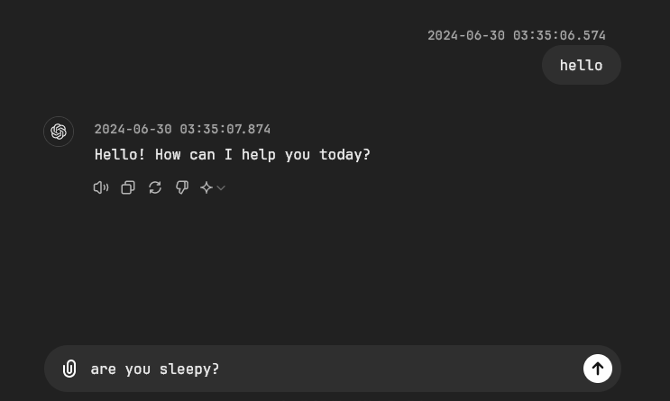
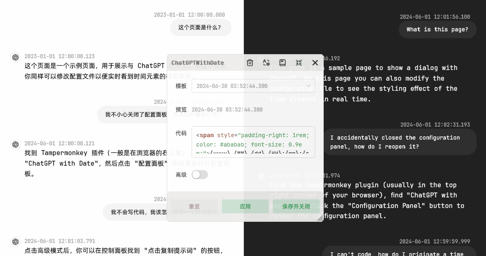

# 
ChatGPT 消息时间

  
  
  
  

## 1. 介绍

有时我们希望看到 ChatGPT 的消息时间，但 ChatGPT 并没有显示消息时间的功能。
本项目通过 Tampermonkey 开发，可以在 Edge、Chrome、Firefox、Safari、Opera 等支持 Tampermonkey 插件的浏览器上使用，
实现显示 ChatGPT 每一条消息时间的功能。

该插件不但可以获取**历史消息时间**，还可以实时获取新消息的时间。

访问 [配置界面](https://jiang-taibai.github.io/chatgpt-with-date-config-page/) 提供多种配置选项。

如果你了解网页三剑客（HTML、CSS、JavaScript），你完全可以高度自定义时间样式。

我们将在第三节介绍如上图所示的配置以及更多的规则。

## 2. 使用方法

### 2.1 安装 Tampermonkey

可查看 [Tampermonkey 首页](https://www.tampermonkey.net/index.php?browser=chrome&locale=zh) 查看详细的使用方法。

### 2.2 安装脚本

访问链接: [Greasy Fork - ChatGPT with Date](https://greasyfork.org/en/scripts/493949-chatgpt-with-date)
，点击 `安装此脚本` 安装脚本。

### 2.3 使用

首次使用请允许跨源资源共享（CORS）请求，本项目将请求 Vue.js 和 NaiveUI 的资源，以便生成配置面板。

打开 ChatGPT 页面，即可看到消息时间。你可以在此处打开配置面板。

## 3. 详细文档

请访问 [ChatGPT with Date 说明文档](https://jiang-taibai.github.io/chatgpt-with-date/) 查看详细配置说明、开发者文档等。

## 4. 反馈

如果你有任何问题或建议，欢迎在 [GitHub Issues](https://github.com/jiang-taibai/chatgpt-with-date/issues)
或 [脚本反馈区](https://greasyfork.org/en/scripts/493949-chatgpt-with-date/feedback) 中提出。

## 5. 未来计划

- [x] 国际化：脚本支持多种语言（日志、提示等）。
- [x] 时间格式化细粒度配置面板：优化时间格式自定义功能，而不是难以维护的 HTML字符串 表示。
- [x] 时间格式化元素：支持更多的时间格式化元素，例如星期、月份（英文）等。
- [x] 时间格式化规则：支持更多的时间格式化规则，例如 12 小时制、24 小时制等。
- [x] 支持分享的界面：支持显示 `https://chatgpt.com/share/uuid` 的界面（即分享的聊天界面）的时间。
- [ ] 主题网站：提供一个主题网站，展示用户分享的时间标签主题。
- [x] 重置脚本：由于会将用户输入的内容应用到本地导致奔溃，提供重置脚本的功能。
- [x] 提供更多的生命周期钩子函数和自定义函数：例如可以自定义时间元素如何解析。

## 6. 开源协议

本项目遵循 [MIT](https://opensource.org/licenses/MIT) 开源协议。

CopyRight © 2024~Present [Jiang Liu](https://coderjiang.com)

## X. Changelog

- v2.0.2 - Unpublished
    - 优化：统一访问 GitHub 部署的资源
    - 新功能：支持分享界面的时间显示
- v2.0.1 - 2024-06-15 16:33:35
    - 修复：解决“切换上下一个消息时时间强制变成当前时间”的问题
- v2.0.0 - 2024-06-13 16:58:05
    - 修复：适应新版 ChatGPT 对话型 UI
    - 新功能：提供全新的配置页面（其实是 ChatGPT 不支持 unsafe-eval 了）
    - 功能调整：为适应新版 UI，不再支持“时间徽标插入位置”
- v1.3.0 - 2024-05-06 19:48:01
    - 新功能：i18n 国际化支持
    - 新功能：提供重置脚本的功能
    - 新功能：提供适应本插件的提示词来生成 HTML、CSS、JavaScript 代码
    - 新功能：提供教程入口
    - 新功能：可收起、展开配置面板
    - 优化：代码输入框支持自定义高度
- v1.2.3 - 2024-05-04 20:04:51
    - 修复：修复无法正常运行用户自定义代码的问题
    - 优化：优化即使用户自定义代码出错也不会影响整个脚本的运行
    - 优化：将渲染顺序调整为最近的消息优先渲染
- v1.2.2 - 2024-05-04 15:24:44
    - 修复：修复消息 ID 属性变化后找不到目标消息 DOM 节点的问题
- v1.2.1 - 2024-05-04 14:33:12
    - 修复：ChatGPT 更新域名
- v1.2.0 - 2024-05-03 21:26:43
    - 优化：限制每次渲染时间标签的次数以及总时长，避免页面卡顿
    - 优化：设置时间标签渲染函数异步执行，避免阻塞页面渲染
    - 优化：修改 Fetch 劫持 URL 匹配规则，更加精确以免干扰其他请求。并在 URL 匹配成功时才进行具体的劫持操作
    - 优化：选择模板时直接显示时间格式的示例，而不是冰冷的模板HTML字符串
    - 新功能：添加更多时间格式的元素，例如星期、月份（英文）等
    - 新功能：添加更多时间格式化规则，例如 12 小时制、24 小时制等
    - 新功能：提供自定义样式的 HTML、CSS、JavaScript 的代码编辑器与注入系统
    - 新功能：提供创建时间标签的生命周期钩子函数 `window.beforeCreateTimeTag(messageId, timeTagHTML)`
      和 `window.afterCreateTimeTag(messageId, timeTagNode)`
- v1.1.0 - 2024-05-02 17:50:04
    - 添加更多时间格式的模板

