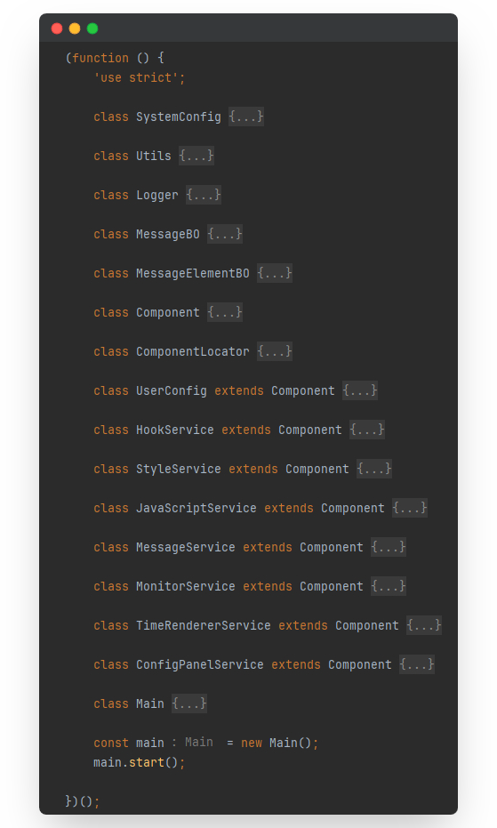
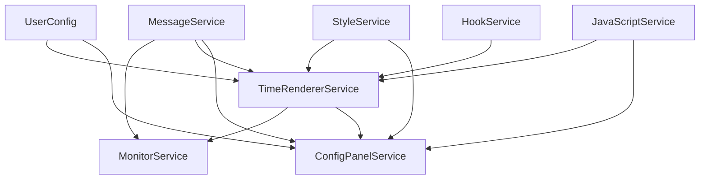
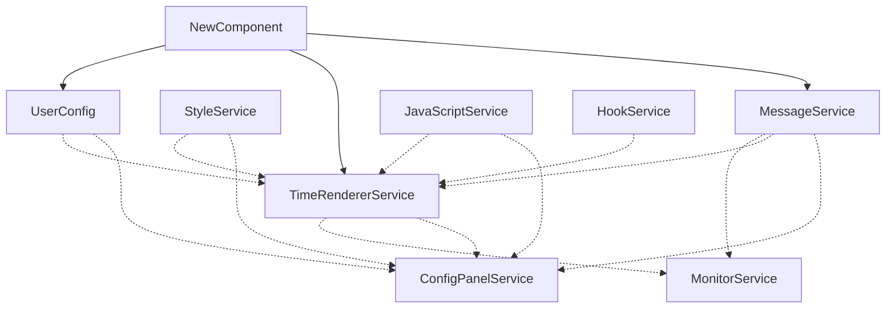

# <div>ChatGPT with Date</div>

<div>
  
  
  
  
</div>

## 1. Introduction

Sometimes we want to see the timestamps of ChatGPT messages, but ChatGPT does not have a feature to display them. This
project, developed through Tampermonkey, can be used on browsers that support the Tampermonkey extension such as Edge,
Chrome, Firefox, Safari, and Opera, to show the timestamp for each ChatGPT message.

This plugin can not only fetch **timestamps of historical messages** but also obtain the timestamps of new messages in
real time.


Visit the [configuration interface](https://jiang-taibai.github.io/chatgpt-with-date-config-page/) for various
configuration options.


If you are familiar with the web trifecta (HTML, CSS, JavaScript), you can fully customize the style of the timestamps.


We will introduce the configurations shown in the images above and more rules in section three.

## 2. How to Use

### 2.1 Install Tampermonkey

Visit the [Tampermonkey homepage](https://www.tampermonkey.net/index.php?browser=chrome&locale=zh) for detailed usage
instructions.

### 2.2 Install the Script

Visit the link: [Greasy Fork - ChatGPT with Date](https://greasyfork.org/en/scripts/493949-chatgpt-with-date)
, and click `Install this script` to install the script.

### 2.3 Usage

Open the ChatGPT page, and you will see the message timestamps. You can open the configuration panel here.


## 3. Configuration

### 3.1 Time Templates

The system's default templates are actually HTML strings. Below are examples of a few default templates:

(1) Standard

<span style="padding-right: 1rem; color: #ababab; font-size: 0.9em;">2024-04-01 18:06:09</span>

```html
<span style="padding-right: 1rem; color: #ababab; font-size: 0.9em;">{yyyy}-{MM}-{dd} {HH}:{mm}:{ss}</span>
```

(2) 12-hour Format

<span style="padding-right: 1rem; color: #ababab; font-size: 0.9em;">May 06, 2024 03:55 PM</span>

```html
<span style="padding-right: 1rem; color: #ababab; font-size: 0.9em;">{MM#shortname@en} {dd}, {yyyy} {HH#12}:{mm} {HH#tag}</span>
```

(3) Badge Style

<span style="padding-right: 1rem; margin-bottom: .5rem; color: #E0E0E0; font-size: 0.9em;"><span style="background: #333; padding: 1px 4px 1px 10px; display: inline-block; border-radius: 8px 0 0 8px;">
2024-05-06</span><span style="background: #606060; padding: 1px 10px 1px 4px; display: inline-block; border-radius: 0 8px 8px 0;">
15:56:22</span></span>

```html
<span style="padding-right: 1rem; margin-bottom: .5rem; color: #E0E0E0; font-size: 0.9em;"><span
        style="background: #333; padding: 1px 4px 1px 10px; display: inline-block; border-radius: 8px 0 0 8px;">{yyyy}-{MM}-{dd}</span><span
        style="background: #606060; padding: 1px 10px 1px 4px; display: inline-block; border-radius: 0 8px 8px 0;">{HH}:{mm}:{ss}</span></span>
```

### 3.3 Advanced Configuration

#### 3.3.1 Time Format

Supported time elements are (using the example of April 3, 2024, at 18:09:01.999 on a Friday):

| Element                                    | Description                                 | Example |
|--------------------------------------------|---------------------------------------------|---------|
| `{yyyy}`                                   | Four-digit year                             | 2024    |
| `{yy}`                                     | Two-digit year                              | 24      |
| `{MM}`, `{MM:02}`                          | Month with two digits minimum               | 04      |
| `{MM:01}`                                  | Month with one digit minimum                | 4       |
| `{MM#name@zh}`                             | Month in Chinese                            | 四       |
| `{MM#name@en}`, `{MM#fullname@en}`         | Month in English                            | April   |
| `{MM#shortname@en}`                        | Month abbreviated in English                | Apr     |
| `{dd}`, `{dd:02}`                          | Day of the month with two digits minimum    | 03      |
| `{dd:01}`                                  | Day of the month with one digit minimum     | 3       |
| `{HH}`, `{HH:02}`, `{HH#24}`, `{HH#24:02}` | Hour in 24-hour format                      | 18      |
| `{HH:01}`, `{HH#24:01}`                    | Hour in 24-hour format without leading zero | 18      |
| `{HH#12}`, `{HH#12:02}`                    | Hour in 12-hour format                      | 06      |
| `{HH#12:01}`                               | Hour in 12-hour format without leading zero | 6       |
| `{HH#tag}`, `{HH#tag@en}`                  | AM/PM indicator in English                  | PM      |
| `{HH#tag@zh}`                              | AM/PM indicator in Chinese                  | 下午      |
| `{mm}`, `{mm:02}`                          | Minutes with two digits minimum             | 09      |
| `{mm:01}`                                  | Minutes with one digit minimum              | 9       |
| `{ss}`, `{ss:02}`                          | Seconds with two digits minimum             | 01      |
| `{ss:01}`                                  | Seconds with one digit minimum              | 1       |
| `{ms}`                                     | Milliseconds                                | 999     |
| `{week}`, `{week:02}`                      | Weekday number                              | 05      |
| `{week:01}`                                | Weekday number without leading zero         | 5       |
| `{week#name@zh}`                           | Weekday in Chinese                          | 五       |
| `{week#name@en}`, `{week#fullname@en}`     | Weekday in English                          | Friday  |
| `{week#shortname@en}`                      | Weekday abbreviated in English              | Fri     |

The advanced configuration offers more customization options, allowing you to customize the HTML, CSS, and JavaScript
code for the time labels.

#### 3.3.2 Hook Functions

This project provides three hook functions, allowing you to implement desired functionalities within these hooks:

- `window.ChatGPTWithDate.hooks.formatDateTimeByDate(date, template)`: This function replaces placeholders in the HTML
  string template with time elements based on a Date object.
    - Default implementation: Replaces placeholders with time elements.
    - `date`: Date object.
    - `template`: String template for time format.
    - Return value: Formatted time string.
- `window.ChatGPTWithDate.hooks.beforeCreateTimeTag(messageId, timeTagHTML)`: Called before creating a time tag, where
  you can modify the HTML content of the time tag.
    - Default implementation: Empty function.
    - `messageId`: ID of the message.
    - `timeTagHTML`: HTML content of the time tag.
- `window.ChatGPTWithDate.hooks.afterCreateTimeTag(messageId, timeTagNode)`: Called after creating a time tag, where you
  can modify the DOM node of the time tag.
    - Default implementation: Empty function.
    - `messageId`: ID of the message.
    - `timeTagNode`: DOM node of the time tag.

#### 3.3.3 Example

In the introductory chapter, we showed how to use the Advanced Configuration feature to display a timestamp that can
display a date as a few days old, and here is the exact code:

```html
<span style="time-tag">{yyyy}-{MM}-{dd} {HH}:{mm}:{ss}</span>
```

```css
.time-tag {
    padding-right: 1rem;
    color: #ababab;
    font-size: 0.9em;
}
```

```javascript
(() => {
    'use strict';

    window.ChatGPTWithDate.hooks.formatDateTimeByDate = (date, template) => {
        const formatValue = (value, format) => value.toString().padStart(format === 'yyyy' ? 4 : 2, '0');
        const dateValues = {
            '{yyyy}': date.getFullYear(),
            '{MM}': date.getMonth() + 1,
            '{dd}': date.getDate(),
            '{HH}': date.getHours(),
            '{mm}': date.getMinutes(),
            '{ss}': date.getSeconds()
        };
        return template.replace(/\{[^}]+\}/g, match => formatValue(dateValues[match], match.slice(1, -1)));
    }
    window.ChatGPTWithDate.hooks.afterCreateTimeTag = (messageId, timeTagContainerNode) => {
        const timeTagNode = timeTagContainerNode.querySelector('.time-tag');
        const dateText = timeTagNode.innerText;
        const date = new Date(dateText);
        timeTagNode.addEventListener('mouseover', () => {
            timeTagNode.innerText = `${Math.floor((new Date() - date) / 86400000)} days ago`;
        });
        timeTagNode.addEventListener('mouseout', () => {
            timeTagNode.innerText = dateText;
        });
    }
})()
```

#### 3.3.4 Cue words ✨

Since it is used on ChatGPT, we can use ChatGPT to generate the HTML, CSS, and JavaScript code corresponding to the
effect you want based on the cue word.

````markdown
# 1. Task Overview

You need to write HTML, CSS, and JavaScript code to meet my requirements. I will provide detailed instructions on how to
write the code.

# 2. HTML Requirements

You need to create an HTML string template for date and time, using placeholders to represent time elements. For
example:

```html
<div class="text-tag-box">
    <span class="date">{yyyy}-{MM}-{dd}</span>
    <span class="time">{HH}:{mm}:{ss}</span>
</div>
```

I will later explain how to use JavaScript to display specific times.

# 3. CSS Requirements

(1) Do not use tag selectors; only use class selectors or ID selectors.  
(2) Use descendant selectors as much as possible to avoid polluting global styles.  
(3) Try to avoid using `!important`.

# 4. JavaScript Requirements

## 4.1 Provided API Interface

APIs are defined on the window object. You may need to override these functions in your JS script if necessary.

- `window.ChatGPTWithDate.hooks.formatDateTimeByDate(date, template)`: Replace the content in the template HTML string
  with the time specified by the `date` object.
    - `date`: JavaScript Date instance.
    - `template`: HTML string, which is your HTML code.
    - Returns: The HTML code after formatting the time.
- `window.ChatGPTWithDate.hooks.beforeCreateTimeTag(messageId, timeTagHTML)`: Called before inserting the template into
  the page.
    - `messageId`: The ID of the message, not the ID of the HTML element.
    - `timeTagHTML`: A
      string, `'<div class="chatgpt-time">' + window.ChatGPTWithDate.hooks.formatDateTimeByDate(date, template) + '</div>'`.
    - Returns: None.
- `window.ChatGPTWithDate.hooks.afterCreateTimeTag(messageId, timeTagContainerNode)`: Called after inserting the
  template into the page.
    - `messageId`: The ID of the message, not the ID of the HTML element.
    - `timeTagNode`: The DOM node
      for `'<div class="chatgpt-time">' + window.ChatGPTWithDate.hooks.formatDateTimeByDate(date, template) + '</div>'`.
    - Returns: None.

## 4.2 API Execution Logic

The system will execute the APIs in the following order:

(1) `template =` your input HTML code.  
(2) `template = window.ChatGPTWithDate.hooks.formatDateTimeByDate(date, template)`  
(3) `timeTagHTML = '<div class="chatgpt-time">' + template + '</div>'`  
(4) `window.ChatGPTWithDate.hooks.beforeCreateTimeTag(messageId, timeTagHTML)`  
(5) Insert `timeTagHTML` into some location.  
(6) `timeTagNode =` the node just inserted.  
(7) `window.ChatGPTWithDate.hooks.afterCreateTimeTag(messageId, timeTagNode)`

## 4.3 Code Conventions

(1) Use ES6 syntax.  
(2) Use strict mode `'use strict'`.  
(3) Use `const` and `let` to declare variables.  
(4) Use IIFE to avoid global variable pollution.  
(5) Use `===` and `!==` to avoid type conversion issues.  
(6) All comments should be in Chinese.

# 5. Example

Here is an example of implementing an effect where, when hovering over the time tag, the date displays as how many days
ago it was.

HTML Code:

```html
<span class="time-tag">{yyyy}-{MM}-{dd} {HH}:{mm}:{ss}</span>
```

CSS Code:

```css
.time-tag {
    padding-right: 1rem; 
    color: #ababab; 
    font-size: 0.9em;
}
```

JavaScript Code:

```javascript
(() => {
    'use strict';
    
    window.ChatGPTWithDate.hooks.formatDateTimeByDate = (date, template) => {
        const formatValue = (value, format) => value.toString().padStart(format === 'yyyy' ? 4 : 2, '0');
        const dateValues = {
            '{yyyy}': date.getFullYear(),
            '{MM}': date.getMonth() + 1,
            '{dd}': date.getDate(),
            '{HH}': date.getHours(),
            '{mm}': date.getMinutes(),
            '{ss}': date.getSeconds()
        };
        return template.replace(/\{[^}]+\}/g, match => formatValue(dateValues[match], match.slice(1, -1)));
    }
    window.ChatGPTWithDate.hooks.afterCreateTimeTag = (messageId, timeTagContainerNode) => {
        const timeTagNode = timeTagContainerNode.querySelector('.time-tag');
        const dateText = timeTagNode.innerText;
        const date = new Date(dateText);
        timeTagNode.addEventListener('mouseover', () => {
            timeTagNode.innerText = `${Math.floor((new Date() - date) / 86400000)} days ago`;
        });
        timeTagNode.addEventListener('mouseout', () => {
            timeTagNode.innerText = dateText;
        });
    }
})()
```

# 6. Your Task

Now you need to write three pieces of code: HTML, CSS, and JavaScript. The requirements are as follows:

- HTML: Only write the time tag HTML.
- CSS: Use class selectors or ID selectors; do not use tag selectors (except as child selectors).
- JavaScript: Write the code within an IIFE and use the three hook functions mentioned.
- Do not repeat unnecessary details; just provide the code blocks, with "This is HTML code," "This is CSS code," and "
  This is JS code" before each block.
- In subsequent conversations, I won't repeat the above details; you need to remember them.
- I will tell you how to improve your code each time, and you need to modify the code accordingly.
- Forget the example code provided; my requirements may differ.

# 7. What you need to accomplish for me

Date and time format example: 2024-04-03 18:09:01  
Customization: Display the date on the left and the time on the right in the time tag, with a vertical line separator
between the date and time. Avoid using background colors; choose a font color suitable for both dark and light modes.  
Additional effect: The time tag should shake slightly when hovered over.
````

#### 3.3.5 Precautions

1. Please avoid using external resources such as images and fonts in your code, as they may be blocked by the website's
   Content Security Policy (CSP).
2. JavaScript: Write your code within an Immediately Invoked Function Expression (IIFE) to avoid using global variables,
   which may lead to errors upon repeated execution.

## 4. Feedback

If you have any questions or suggestions, feel free to post them
on [GitHub Issues](https://github.com/jiang-taibai/chatgpt-with-date/issues) or in
the [Script Feedback section](https://greasyfork.org/en/scripts/493949-chatgpt-with-date/feedback) on Greasy Fork.

## 5. Future Plans

- [x] Internationalization: The script supports multiple languages (logs, prompts, etc.).
- [x] Granular Configuration Panel for Time Formatting: Enhance the customization of time formats beyond the
  hard-to-maintain HTML string representations.
- [x] Time Formatting Elements: Support for more time formatting elements, such as weekdays and months (in English).
- [x] Time Formatting Rules: Support for more time formatting rules, like 12-hour and 24-hour formats.
- [x] Support for Shared Interface: Display the time on interfaces like `https://chatgpt.com/share/uuid` (i.e., shared
  chat interfaces).
- [ ] Theme Website: Provide a theme website to showcase user-shared time tag themes.
- [x] Script Reset: Provide a script reset feature due to crashes caused by applying user input locally.
- [x] Additional Lifecycle Hook Functions and Custom Functions: For example, customization of how time elements are
  parsed.

## 6. Open source protocol

This project follows the [MIT](https://opensource.org/licenses/MIT) open source license.

CopyRight © 2024~Present [Jiang Liu](https://coderjiang.com)

## 7. Developer Documentation

### 7.1 Project Organization Structure



This project utilizes Dependency Injection (DI) to organize various components, including the following key parts:

- `UserConfig`: User configuration data, including time format and time placement preferences.
- `StyleService`: Style service responsible for tracking and managing variable styles.
- `JavaScriptService`: JavaScript service responsible for managing and storing variable JavaScript code.
- `MessageService`: Message service responsible for managing and storing message information.
- `MonitorService`: Monitoring service that hijacks Fetch requests and tracks the addition of new messages in real-time.
- `TimeRendererService`: Time rendering service that handles the rendering of time.
- `ConfigPanelService`: Configuration panel service responsible for generating a configuration panel based on
  Vue+NaiveUI.
- `HookService`: Hook service responsible for managing lifecycle hook functions.

The dependency relationships among these services are as follows:



The Dependency Injection (DI) method used in this project prevents the occurrence of circular dependencies and the DI
design architecture allows components to remain independent of the specific implementations of their dependencies. This
technique facilitates easier understanding, maintenance, and testing of the code. Circular dependencies are avoided
because they violate the Single Responsibility Principle and the Dependency Inversion Principle.

### 7.2 Defining a New Component

If you want to customize a new component, you will need to:

#### 7.2.1 Define a New Component Class

- **Inheritance**: The class must inherit from the `Component` class.
- **Constructor**: Define the `dependencies` attribute in the constructor. This attribute should be an array where each
  element is an object containing two properties: `field` and `clazz`, representing the dependent field name and class,
  respectively.
- **Dependency Injection**: Avoid any operations in the constructor other than defining dependencies, as the injection
  of dependencies is done in the `Component::initDependencies` method. Dependencies are not usable before this method is
  executed.
- **Initialization Function**: Perform formal initialization in the `init` method, where you can use the injected
  properties.
- **Dependency Relationships**: Avoid circular dependencies to prevent initialization failures.

```javascript
class NewComponent extends Component {
    constructor() {
        super();
        this.userConfig = null;
        this.timeRendererService = null;
        this.messageService = null;
        this.dependencies = [
            {field: 'userConfig', clazz: UserConfig},
            {field: 'timeRendererService', clazz: TimeRendererService},
            {field: 'messageService', clazz: MessageService},
        ];
    }

    init() {
        // Formal initialization
    }
}
```

In unavoidable situations of circular dependencies, they can be resolved as follows:

```javascript
class NewComponent extends Component {
    constructor() {
        super();
    }

    init() {
        this.cycleDependentComponent = ComponentLocator.get(CycleDependentComponent);
    }
}
```

#### 7.2.2 Register the Component

Register your component in `Main.ComponentsConfig`. You do not need to worry about the order of registration because the
Main class will automatically initialize components in order of their dependency relationships.

```javascript
class Main {
    static ComponentsConfig = [
        UserConfig, StyleService, MessageService,
        MonitorService, TimeRendererService, ConfigPanelService,
        JavaScriptService, HookService,
        NewComponent,
    ];
}
```

With this addition, the dependency graph is updated as shown below:



### 7.3 Some Recommendations

#### 7.3.1 Injecting External JavaScript Libraries

It is advised to use `GM_xmlhttpRequest` to fetch external JavaScript libraries and then inject them as strings into the
page. Direct inclusion of external JavaScript libraries in the page may encounter Content Security Policy (CSP)
restrictions. Below is an example of injecting Vue.js and NaiveUI into the project:

```javascript
function loadScript() {
    return new Promise(resolve => {
        // 😄 Recommended approach: Use GM_xmlhttpRequest to fetch external JavaScript libraries and inject them as strings into the page.
        // You can use StyleService and JavaScriptService to update styles and JavaScript codes using unique keys.
        let completeCount = 0;
        const resources = [
            {type: 'js', url: 'https://example.com/example.js'},
            {type: 'css', url: 'https://example.com/example.css'}
        ];
        resources.forEach(resource => {
            GM_xmlhttpRequest({
                method: "GET",
                url: resource.url,
                onload: function (response) {
                    if (resource.type === 'js') {
                        this.javaScriptService.updateJavaScript('uniqueJavaScriptKey', response.responseText);
                    } else if (resource.type === 'css') {
                        this.styleService.updateStyle('uniqueStyleKey', response.responseText);
                    }
                    completeCount++;
                    if (completeCount === resources.length) {
                        resolve();
                    }
                }
            });
        });
        // 😢 Not recommended approach: Directly injecting external JavaScript libraries into the page, which faces CSP restrictions.
        // const naiveScript = document.createElement('script');
        // naiveScript.setAttribute("type", "text/javascript");
        // naiveScript.src = "https://example.com/example.js";
        // document.documentElement.appendChild(naiveScript);
    })
}
```

#### 7.3.2 Make Modifications Based on Existing Foundations

Here's an explanation of some of the classes that can be shared:

- **`SystemConfig`**: This class holds system configurations, including constants and default settings. If you need to
  add some constants, this is where you can do it.
- **`Utils`**: A utilities class that includes common utility methods such as time formatting and string formatting.
  This is useful for handling frequently repeated logic throughout the project.
- **`Logger`**: A logging class used to output log information. If you need to output debugging information, you should
  use this class. It's recommended to use `Logger.*` instead of `console.*` to keep logging centralized and potentially
  more manageable.
- **`HookService`**: The hook service is responsible for managing lifecycle hook functions. If you need to add some
  lifecycle hooks, you can add them here.
- **`StyleService`**: The style service manages CSS styles. You can register styles with a unique `key` and then simply
  update the style using this `key` later on.
- **`JavaScriptService`**: This service manages JavaScript code. You can register JavaScript with a unique `key` and
  update the JavaScript code using this `key` as needed.

## X. Changelog

- **v2.0.2 - 2024-07-29 02:11:47**
    - **Optimization**: Unified access to resources hosted on GitHub.
    - **New Feature**: Support for displaying time on shared interfaces.
    - **Fix**: Improve the grammatical hints of prompt words, and provide both Chinese and English versions.
    - **New**: Provide English documentation
    - **Optimization**: provide more menu items for users to view documents, feedback, etc.

- **v2.0.1 - 2024-06-15 16:33:35**
    - **Fix**: Resolved the issue where switching between messages forces the time to update to the current time.

- **v2.0.0 - 2024-06-13 16:58:05**
    - **Fix**: Adapted to the new ChatGPT conversational UI.
    - **New Feature**: Introduced a new configuration page (due to ChatGPT's lack of support for `unsafe-eval`).
    - **Feature Adjustment**: To accommodate the new UI, support for "time badge insertion position" was removed.

- **v1.3.0 - 2024-05-06 19:48:01**
    - **New Features**:
        - Internationalization (i18n) support.
        - Functionality to reset the script.
        - Custom prompts to generate HTML, CSS, and JavaScript code suitable for this plugin.
        - Tutorial access.
        - Ability to collapse and expand the configuration panel.
    - **Optimization**: Support for customizing the height of the code input box.

- **v1.2.3 - 2024-05-04 20:04:51**
    - **Fix**: Resolved an issue preventing custom user code from running properly.
    - **Optimization**:
        - Ensured that errors in custom code do not affect the entire script.
        - Adjusted the rendering order to prioritize the most recent messages.

- **v1.2.2 - 2024-05-04 15:24:44**
    - **Fix**: Resolved issues with message ID attribute changes leading to failures in locating target message DOM
      nodes.

- **v1.2.1 - 2024-05-04 14:33:12**
    - **Fix**: Updated domain names for ChatGPT.

- **v1.2.0 - 2024-05-03 21:26:43**
    - **Optimizations**:
        - Limited the number and total duration of time label renderings to prevent page lag.
        - Set time label rendering functions to execute asynchronously to avoid blocking page rendering.
        - Enhanced Fetch hijacking URL matching rules for accuracy and minimized interference with other requests.
          Hijacking operations are now performed only when URL matches are confirmed.
        - Replaced cold template HTML strings with direct examples of time formats when selecting templates.
    - **New Features**:
        - Added more elements for time formats, such as weekdays and months in English.
        - Added more rules for time formatting, such as 12-hour and 24-hour formats.
        - Introduced a code editor and injection system for custom HTML, CSS, and JavaScript styles.
        - Provided lifecycle hook functions `window.beforeCreateTimeTag(messageId, timeTagHTML)`
          and `window.afterCreateTimeTag(messageId, timeTagNode)`.

- **v1.1.0 - 2024-05-02 17:50:04**
    - **New Feature**: Added more templates for time formats.
